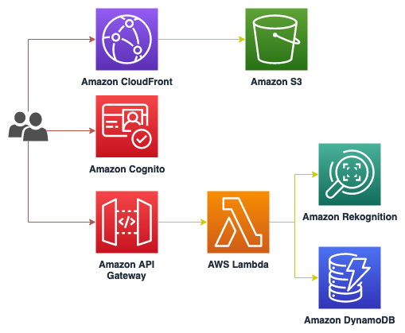

# Facial Recognition for Employee / Student Attendance

**This code is for demo purpose only and not for production.**

This is a demo app to show how Amazon Rekognition and AWS services can be used to build an app that can use facial recognition to register student or employee attendance. 

This web-app is modified from https://github.com/aws-samples/amazon-rekognition-ppe/. It uses AWS SAM (serverless application model) to build the backend API and the frontend uses reactJs that will be hosted on Amazon S3 and CloudFront.

## Architecture
<p align="center">
  
</p>

## Usage

### Prerequisites
- AWS S3 bucket containing pictures of the students / employees
- npm cli
- SAM cli
- aws cli

### Deploy backend

1. Create S3 bucket to store the SAM package, example:
```
aws s3 mb attendance-demo-sam-1j2hjkl
```

2. Build the SAM package:
```
cd src/cfn
sam build
```

3. Deploy SAM package. Replace the S3 bucket with the bucket that you created in step 1 and also put your email address for the admin user.
```
sam deploy --template-file template.yaml --s3-bucket <YOUR-SAM-BUCKET> --capabilities CAPABILITY_IAM CAPABILITY_AUTO_EXPAND --stack-name attendance-demo --parameter-overrides AdminEmail=<YOUR-EMAIL-ADDRESS>

# Example
# sam deploy --template-file template.yaml --s3-bucket attendance-demo-sam-1j2hjkl --capabilities CAPABILITY_IAM CAPABILITY_AUTO_EXPAND --stack-name attendance-demo --parameter-overrides AdminEmail=myemail@myemail.com
```

4. :bangbang: **Take note of the stack outputs e.g. uiBucket, apiGateway, and cognito details** :bangbang:

### Deploy frontend

1. Go to web-ui folder and install dependencies
```
cd src/web-ui
npm install
```

2. :bangbang: Edit the file **public/settings.js** with the values from backend stack outputs (step 4 of section **Deploy backend**) :bangbang:

3. Build the frontend files
```
npm run build
```

4. Copy frontend files to the S3 bucket for the web UI. The bucket name can be found on the stack output with key "uiBucket" (from step 4 in deploying backend).

```
aws s3 sync ./build/ s3://<uiBucket>
```

### Create Amazon Rekognition collection

1. Create collection with id 'attendeesCollection'
```
aws rekognition create-collection --collection-id attendeesCollection 
```

2. Index each photo of the employee / student. Use their name or ID as the external-image-id.
```
aws rekognition index-faces --image '{"S3Object":{"Bucket":"<S3BUCKET>","Name":"<MYFACE_KEY>.jpeg"}}' --collection-id "attendeesCollection" --detection-attributes "ALL" --external-image-id "<PERSON_NAME>"
```

3. To illustrate students / employees who have not checked-in, you can go to the dynamodb table "attendance-table" and fill out the names of the persons.

### Accessing the webapp

1. Find the website URL on the stack output with key "url"

2. You should receive an email containing a temporary password to login.

